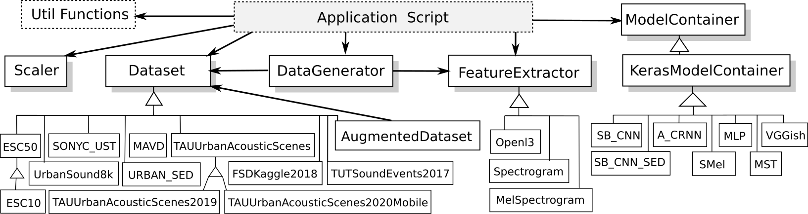

Tutorial and examples
=====================

This is a tutorial introduction to quickly get you up and running with `DCASE-models`

The package of the library includes a set of examples, organized into three different categories, which illustrate the usefulness of `DCASE-models` for carrying out research experiments or developing applications. These examples can also be used as templates to be adapted for implementing specific DCASE methods. The type of examples provided are:

 - scripts that perform each step in the typical development pipeline of a DCASE task
 - Jupyter Notebooks that replicate some of the experiments reported in the literature 
 - a web interface for sound classification as an example of a high--level application

The :ref:`following section <example_scripts>` gives a walk-through of the example scripts provided. Then, the :ref:`next section <library_organization>` describes the library organization and exemplifies the use of the most important classes and functionalities. 

.. _example_scripts:

Example scripts
---------------

A set of Python scripts is provided in the ``examples`` folder of the package. They perform each step in the typical development pipeline of a DCASE task, i.e downloading a dataset, data augmentation, feature extraction, model training, fine-tuning, and model evaluation. Follow the instructions bellow to know how they are used. 

Parameters setting
~~~~~~~~~~~~~~~~~~

First, note that the default parameters are stored in the ``parameters.json`` file at the root folder of the package. You can use other ``parameters.json`` file by passing its path in the ``-p`` (or ``--path``) argument of each script.

Usage information
~~~~~~~~~~~~~~~~~

In the following, we show examples on how to use these scripts for the typical development pipeline step by step. For further usage information please check each script instructions by typing::

    python download_dataset.py --help

Dataset downloading
~~~~~~~~~~~~~~~~~~~

First, let's start by downloading a dataset. For instance, to download the `ESC-50`_ dataset just type::

    python download_dataset.py -d ESC50

.. note::
    Note that by default the dataset will be downloaded to the ``../datasets/ESC50`` folder, following the path set in the ``parameters.json`` file. 
    You can change the path or the ``parameters.json`` file. The datasets available are listed in the :ref:`Datasets <datasets>` section.

Data augmentation
~~~~~~~~~~~~~~~~~

If you want to use data augmentation techniques on this dataset, you can run the following script::

    python data_augmentation.py -d ESC50

.. note::
    Note that the name and the parameters of each transformation are defined in the ``parameters.json`` file. 
    The augmentations implemented so far are pitch-shifting, time-stretching, and white noise addition.
    Please check the :class:`~dcase_models.data.AugmentedDataset` class for further information. 

Feature extraction
~~~~~~~~~~~~~~~~~~

Now, you can extract the features for each file in the dataset by typing::

    python extract_features.py -d ESC50 -f MelSpectrogram

.. note::
    Note that you have to specify the features name by the ``-f`` argument, in this case :class:`~dcase_models.data.MelSpectrogram`. 
    All the features representations available are listed in the :ref:`Features <features>` section.

Model training
~~~~~~~~~~~~~~

To train a model is also very straightforward. For instance, to train the :class:`~dcase_models.model.SB_CNN` model on the `ESC-50`_ dataset with the :class:`~dcase_models.data.MelSpectrogram` features extracted before just type::

    python train_model.py -d ESC50 -f MelSpectrogram -m SB_CNN -fold fold1

.. note::
   Note that in this case you have to pass the model name and a fold name as an argument, using ``-m`` and ``-fold``, respectively. 
   This fold is considered to be the fold for testing, meaning that it will not be used during training.
   All the implemented models available are listed in the :ref:`Implemented models <implemented_models>` section.

Model evaluation
~~~~~~~~~~~~~~~~

Once the model is trained, you can evaluate the model in the test set by typing::

    python evaluate_model.py -d ESC50 -f MelSpectrogram -m SB_CNN -fold fold1

.. note::
    Note that the fold specified as an argument is the one used for testing. This scripts prints the results that we get from `sed_eval`_ library.

Fine-tuning
~~~~~~~~~~~

Once you have a model trained in some dataset, you can fine-tune the model on another dataset. For instance, to use a pre-trained model on the `ESC-50`_ dataset and fine-tune it on the `MAVD`_ dataset just type::

    python fine_tuning.py -od ESC50 -ofold fold1 -f MelSpectrogram -m SB_CNN -d MAVD -fold test

.. note::
    Note that the information of the original dataset is set by the ``-od`` and ``-ofold`` arguments. Besides, the ``-d`` and ``-fold`` arguments set the new dataset and the test fold, respectively.

.. _library_organization:

Library organization
--------------------

A description of the main classes and functionalities of the library is presented in this section, following the order of the typical pipeline: dataset preparation, data augmentation, feature extraction, data loading, data scaling, and model handling. Example code is provided for each step, but please check the documentation of the classes for further information. 

The following is a class diagram of `DCASE-models` showing all the base classes and some of the implemented specializations.

Dataset
~~~~~~~

This is the base class designed to manage a dataset, its paths, and its internal structure. It includes methods to download the data, resample the audio files, and check that both processes succeed.

The library covers several publicly available datasets related to different tasks. Please check the list of currently available datasets in the :ref:`Datasets <datasets>` section. 

Each dataset is implemented in the library as a class that inherits from :class:`~dcase_models.data.Dataset`. This design provides a common and simple interface to work with any dataset. For instance, to use the `UrbanSound8k`_ dataset, it is enough to initialize its class with the path to the data folder, as follows.

.. code-block:: python

    dataset = UrbanSound8k(DATASET_PATH)

Then, the following methods are used to download the dataset and change its sampling rate (to 22050 Hz).

.. code-block:: python

    dataset.download()
    dataset.change_sampling_rate(22050)

.. note::
    Note that most of the datasets devised for research include a fold split and a corresponding evaluation setup (e.g. 5-fold cross-validation). This fold split is generally carefully selected to avoid biases and data contamination. In order to keep the results comparable to those reported in the literature, DCASE-models uses, whenever available, the predefined splits for each dataset. However, the user may define different splits or evaluation setups if needed.

AugmentedDataset
~~~~~~~~~~~~~~~~

The previously defined ``dataset`` instance can be expanded using data augmentation techniques. The augmentations implemented so far are pitch-shifting, time-stretching, and white noise addition. The first two are carried out by means of `pysox`_.

An augmented version of a given dataset can be obtained by initializing an instance of the :class:`~dcase_models.data.AugmentedDataset` class with the ``dataset`` as a parameter, as well as a dictionary containing the name and parameters of each transformation.

.. code-block:: python

    aug_dataset = AugmentedDataset(dataset,
                                   augmentations)

After initialization, the following method will perform the actual augmentation and create new audio files for every dataset element according to the type and parameters of each augmentation.

.. code-block:: python

    aug_dataset.process()

.. note::
    Note that the augmented dataset is indeed an instance of :class:`~dcase_models.data.Dataset`, so it can be used as any other dataset in the following steps of the pipeline.

FeatureExtractor
~~~~~~~~~~~~~~~~

This is the base class to define different types of feature representations. It has methods to load an audio file, extract features, and save them. It can also check if the features were already extracted. 

Feature representations are implemented as specializations of the base class :class:`~dcase_models.data.FeatureExtractor`, for instance, :class:`~dcase_models.data.Spectrogram`. Please check the list of currently available features in the :ref:`Features <features>` section.

A :class:`~dcase_models.data.FeatureExtractor` is initialized with some parameters. For instance, to define a :class:`~dcase_models.data.MelSpectrogram` feature extractor the parameters are: length and hop in seconds of the feature representation analysis window (``sequence_time`` and ``sequence_hop_time``); window length and hop size (in samples) for the short-time Fourier Transform (STFT) calculation (``audio_win`` and ``audio_hop``); and the audio sampling rate (``sr``).

.. code-block:: python

    features = Spectrogram(sequence_time=1.0, sequence_hop_time=0.5,
                           audio_win=1024, audio_hop=512, sr=22050) 

After initialization, the following method computes the features for each audio file in the dataset.

.. code-block:: python

    features.extract(dataset)

Once the features are extracted and saved to disk, they can be loaded using :class:`~dcase_models.data.DataGenerator` as explained in the following.

.. note::
    Note that if the audio files are not sampled at the given frequency, they are converted before calculating the features.

DataGenerator
~~~~~~~~~~~~~

This class uses instances of :class:`~dcase_models.data.Dataset` and :class:`~dcase_models.data.FeatureExtractor` to prepare the data for model training, validation and testing. An instance of this class is created for each one of these processes.

.. code-block:: python

    data_gen_train = DataGenerator(dataset,
                                   features,
                                   train=True, 
                                   folds=[’train’])

    data_gen_val = DataGenerator(dataset,
                                 features,
                                 train=False,
                                 folds=[’val’])

At this point of the pipeline, the features and the annotations for training the model can be obtained as follows.

.. code-block:: python

    X_train, Y_train = data_gen_train.get_data()

.. note::
    Note that instances of :class:`~dcase_models.data.DataGenerator` can be used to load data in batches. This feature is especially useful for traininga models on systems with memory limitations.

Scaler
~~~~~~

Before feeding data to a model, it is common to normalize the data or scale it to a fixed minimum and maximum value. To do this, the library contains a :class:`~:dcase_models.data.Scaler` class, based on `scikit-learn`_ preprocessing functions, that includes ``fit`` and ``transform`` methods. 

.. code-block:: python

    scaler = Scaler("standard")
    scaler.fit(X_train)
    X_train = scaler.transform(X_train)

In addition, the scaler can be fitted in batches by means of passing the :class:`~dcase_models.data.DataGenerator` instance instead of the data itself.

.. code-block:: python

    scaler.fit(data_gen_train)

It is also possible to scale the data as it is being loaded from the disk, for instance, when training the model. To do so, the :class:`~:dcase_models.data.Scaler` can be passed to the :class:`~dcase_models.data.DataGenerator` after its initialization.

.. code-block:: python

    data_gen_val.set_scaler(scaler)

ModelContainer
~~~~~~~~~~~~~~

This class defines an interface to standardize the behavior of machine learning models. It stores the architecture and the parameters of the model. It provides methods to train and evaluate the model, and to save and load its architecture and weights. It also allows the inspection of the output of its intermediate stages (i.e. layers).

The library also provides a container class to define `Keras`_ models, namely :class:`~:dcase_models.model.KerasModelContainer`, that inherits from :class:`~:dcase_models.model.ModelContainer`, and implements its functionality using this specific machine learning backend. Even though the library currently supports only `Keras`_, it is easy to specialize the :class:`~:dcase_models.model.ModelContainer` class to integrate other machine learning tools, such as `PyTorch`_.

Each model has its own class that inherits from a specific :class:`~:dcase_models.model.ModelContainer`, such as :class:`~:dcase_models.model.KerasModelContainer`. Please check the list of currently available features in the :ref:`Implemented models <implemented_models>` section. 

A model's container has to be initialized with some parameters. These parameters vary across models, among which the most important are: input shape, number of classes, and evaluation metrics. Specific parameters may include the number of hidden layers or the number of convolutional layers, among others. 

.. code-block:: python

    model_cont = SB_CNN(**model_params)

The :class:`~:dcase_models.model.ModelContainer` class has a method to train the model. Training parameters can include, for example, number of epochs, learning rate and batch size.

.. code-block:: python

    model_cont.train((X_train, Y_train), **train_params)

To train the model in batches, the :class:`~dcase_models.data.DataGenerator` object can be passed to the ``train`` method instead of the pre-loaded data.

.. code-block:: python

    model_cont.train(data_gen_train, **train_params)

Performing model evaluation is also simple. For instance, the following code uses the test set for evaluating the model.

.. code-block:: python

    data_gen_test = DataGenerator(dataset,
                                  features,
                                  train=False,
                                  folds=[’test’])
    X_test, Y_test = data_gen_test.get_data()
    results = model_cont.evaluate((X_test, Y_test))

The results' format depends on which metrics are used. By default, the evaluation is performed using the metrics available from the `sed_eval`_ library. Therefore, the results are presented accordingly. Nevertheless, `DCASE-models` enables the use of others evaluating frameworks such as `psds_eval`_, or the use of user-defined metrics in a straightforward way.

When building deep-learning models it is common practice to use fine-tuning and transfer learning techniques. In this way, one can reuse a network that was previously trained on another dataset
or for another task, and adapt it to the problem at hand. This type of approach can also be carried out with the :class:`~:dcase_models.model.ModelContainer`.

.. _ESC-50: https://github.com/karolpiczak/ESC-50
.. _sed_eval: https://tut-arg.github.io/sed_eval/
.. _MAVD: https://doi.org/10.5281/zenodo.3338727
.. _UrbanSound8k: https://urbansounddataset.weebly.com/urbansound8k.html
.. _pysox: https://github.com/rabitt/pysox
.. _scikit-learn: https://scikit-learn.org/
.. _Keras: https://keras.io/
.. _PyTorch: https://pytorch.org/
.. _psds_eval: https://github.com/audioanalytic/psds_eval 
